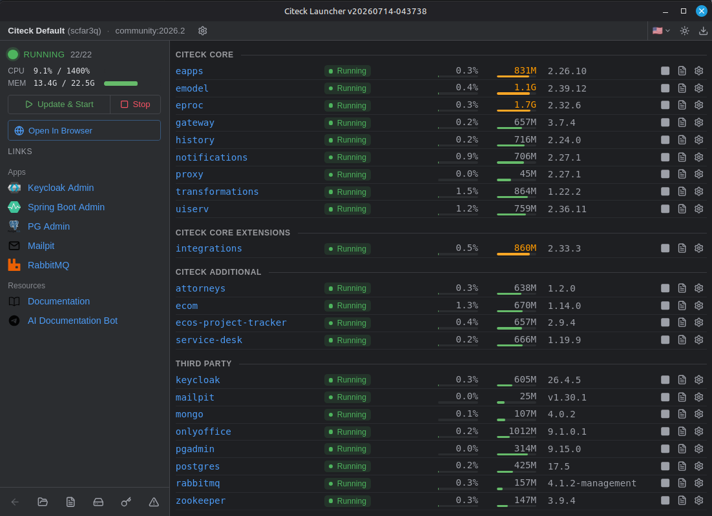

# Citeck Launcher

[English](../README.md) · [Русский](README.ru.md) · [中文](README.zh.md) · **Español** · [Deutsch](README.de.md) · [Français](README.fr.md) · [Português](README.pt.md) · [日本語](README.ja.md)

[](https://github.com/Citeck/citeck-launcher/releases/latest)
[](https://github.com/Citeck/citeck-launcher/releases)
[](https://www.gnu.org/licenses/lgpl-3.0)

[](https://citeck-ecos.readthedocs.io/en/latest/index.html)

**La forma oficial de ejecutar Citeck.**

[Citeck](https://github.com/Citeck) es una plataforma low-code autoalojada y de código abierto que reemplaza a las suites propietarias de ECM/BPM. La usas para casi cualquier tarea que involucre documentos corporativos, desde la aprobación de contratos y compras hasta procesos de RR. HH., un archivo electrónico o un portal corporativo. Dibujas la ruta de cada proceso en el diseñador BPMN integrado y configuras los tipos de documentos sin código; los usuarios, roles y permisos vienen incorporados.

Citeck Launcher es la forma más sencilla de poner la plataforma en marcha y mantenerla así. Descargas un único binario de ~24 MB: instala la plataforma y arranca sus servicios a través de Docker. A partir de ahí, Launcher vigila su estado y reinicia automáticamente todo lo que se caiga, y hace que actualizar la plataforma sea simple y predecible. En tu propio equipo funciona como aplicación de escritorio; en un servidor, desde la línea de comandos.



**Necesitarás:** Docker · **16 GB** de RAM para la edición Community, **24–32 GB** para Enterprise (~24 servicios) · **más de 50 GB** de disco libre para imágenes y datos. En Windows y macOS, instala primero [Docker Desktop](https://www.docker.com/products/docker-desktop/).

## ¿Escritorio o servidor?

Hay dos maneras de ejecutarlo — elige la que se ajuste a **dónde** quieres que se ejecute Citeck:

| | 🖥 **Aplicación de escritorio** | 🖧 **Servidor (CLI)** |
|---|---|---|
| Para | Tu propio equipo | Un servidor / VM Linux (normalmente por SSH) |
| Instalación | Descarga un instalador y sigue el asistente | Un solo comando `curl … \| bash` |
| Interfaz | Ventana nativa de la aplicación (GUI) | Terminal — CLI `citeck` + asistente de configuración |
| Empieza aquí | [Aplicación de escritorio](#aplicación-de-escritorio) | [Instalación en servidor](#instalación-en-servidor) |

> **Aviso:** el inicio rápido con `curl … | bash` y los comandos `citeck` de este README son para **instalaciones en servidor**. En tu propio equipo, ejecuta Citeck a través de la **aplicación de escritorio** — allí todo se hace desde la interfaz.

## Aplicación de escritorio

La aplicación de escritorio ejecuta Citeck en tu propia máquina con Windows, macOS o Linux: una ventana de aplicación normal, sin línea de comandos. Citeck sigue funcionando en segundo plano incluso después de cerrar la ventana.

Instala primero Docker Desktop y luego descarga el instalador de tu plataforma desde la [última versión](https://github.com/Citeck/citeck-launcher/releases/latest):

| SO | Archivo | Arquitectura |
|----|------|------|
| Windows | `citeck-desktop_<version>_windows_<arch>.msi` | amd64, arm64 |
| macOS | `citeck-desktop_<version>_darwin_<arch>.dmg` | amd64 (Intel), arm64 (Apple Silicon) |
| Linux | `citeck-desktop_<version>_linux_<arch>.deb` / `.rpm` | amd64, arm64 |

Cada instalador tiene un archivo adjunto `.sha256` para su verificación. Tus datos se conservan durante las actualizaciones.

## Instalación en servidor

> **Para un servidor o VM Linux** (amd64 o arm64) — ejecuta estos pasos en el servidor, por SSH. Requisito previo: Docker instalado y en ejecución.

```bash
curl -fsSL https://github.com/Citeck/citeck-launcher/releases/latest/download/install.sh | bash
```

El script descarga la última versión para tu plataforma, la instala en `/usr/local/bin/citeck` y a continuación lanza el asistente de configuración (`citeck install`). El asistente es **interactivo y necesita una terminal real**. Te pregunta:

- el **nombre de dominio o la IP** que usarás para acceder a la plataforma desde el navegador;
- cómo **asegurar la conexión** — automático, Let's Encrypt, un certificado autofirmado, tu propio certificado o HTTP sin cifrar. (Let's Encrypt necesita un nombre DNS público que apunte a este host y el puerto 80 accesible desde fuera; si no es alcanzable, el asistente recurre a un certificado autofirmado.)
- si desplegar **datos de demostración** y si instalar un **servicio systemd**.

### Primer arranque: qué esperar

**Tarda un rato — es normal.** El launcher descarga varios GB de imágenes Docker y después la plataforma necesita unos **10–15 minutos** para levantarse: los servicios arrancan en orden de dependencias y Keycloak importa su realm en el primer inicio. Observa cómo las aplicaciones pasan a `RUNNING` una a una:

```bash
citeck status -w
```

Cuando todo esté en marcha, el asistente imprime tus datos de acceso:

```
Citeck is ready!

Open in browser:  https://<the domain you entered>/
Login:            admin / <generated password>
```

Dos cosas que conviene saber sobre esa pantalla:

- **La contraseña de administrador se muestra una sola vez.** Cópiala — después no se puede recuperar. Si la pierdes, restablécela con `citeck setup admin-password`.
- **Con un certificado autofirmado el navegador te avisará.** Es lo esperado — haz clic en *Configuración avanzada* → *Continuar*.

Si después de unos 20 minutos algo sigue atascado, empieza por `citeck diagnose` (añade `--fix` para que repare lo que pueda) y `citeck logs <app>`.

### Actualizar el launcher

Ejecuta de nuevo el mismo comando de una sola línea — el script detecta la versión instalada, solicita confirmación para actualizar, detiene el demonio y reemplaza el binario. El binario anterior se conserva en `/usr/local/bin/citeck.bak` y se puede restaurar con `citeck install --rollback`. Tus datos se conservan.

## Conceptos

Tres palabras que aparecen por toda la CLI y la documentación:

- **Namespace** — una instancia aislada de la plataforma (con sus propios contenedores, volúmenes y datos). No tiene nada que ver con los namespaces de Linux o Kubernetes; es un concepto del launcher. Un servidor típico ejecuta exactamente uno.
- **Bundle** — qué aplicaciones y qué versiones componen una release de la plataforma, por ejemplo una release Community o Enterprise. `citeck upgrade <bundle:version>` cambia de una a otra.
- **Workspace** — de dónde provienen esas definiciones (normalmente un repositorio Git, o un `.zip` sin conexión para instalaciones aisladas de la red).

## Comandos del día a día (modo servidor)

En modo escritorio, las mismas operaciones están disponibles desde la interfaz de la aplicación.

```bash
citeck status -w                 # observa el namespace y cada aplicación
citeck logs <app> -f             # transmite los logs (sin aplicación = el log del propio demonio)
citeck stop <app>                # detén una aplicación — y mantenla detenida entre reinicios
citeck start <app>               # vuelve a iniciarla (reacoplar)
citeck reload                    # aplica los cambios de configuración, recrea solo lo que cambió
citeck snapshot export <name>    # respalda todos los volúmenes (detiene la plataforma y luego la reinicia)
citeck upgrade <bundle:version>  # cambia a otra versión de la plataforma
citeck diagnose --fix            # comprobaciones de estado con reparación automática opcional
citeck setup                     # cambia ajustes (contraseña de admin, TLS, correo, recursos…)
citeck edit <app>                # edita la definición de una aplicación, al estilo de kubectl edit
```

Ten en cuenta que `citeck stop <app>` **desacopla** la aplicación: permanece detenida entre reinicios y recargas hasta que ejecutes `citeck start <app>`. Esa es también la forma de liberar memoria en un host pequeño — desacoplar unas cuantas aplicaciones opcionales ahorra varios GB.

Flags globales: `--format (text|json)` para scripting, `--yes/-y` para omitir confirmaciones, `-d/--detach` para volver de inmediato en lugar de esperar. Referencia completa: `citeck --help` o la [referencia de comandos](https://citeck-ecos.readthedocs.io/en/latest/admin/launch_setup/launcher_server/commands.html).

## Qué obtienes

- **Entorno de ejecución autorreparable** — las sondas de actividad reinician los servicios caídos y el launcher registra por qué se cayeron
- **Copia de seguridad y restauración** — exporta todos los volúmenes a un único archivo e impórtalos de vuelta en este host o en otro
- **HTTPS desde el primer momento** — Let's Encrypt con renovación automática (dominios *y* direcciones IP), o tu propio certificado
- **Estado y logs en vivo** — uso de recursos y logs en streaming para cada servicio, en la aplicación de escritorio o en la CLI
- Localizado en 8 idiomas, con autocompletado de shell para bash, zsh, fish y PowerShell

## Ediciones

La edición **Community** es totalmente de código abierto y gratuita, y cubre la funcionalidad principal de la plataforma. La edición comercial **Enterprise** añade soporte profesional y funciones adicionales; su instalación requiere una clave de licencia emitida por Citeck. Este launcher instala cualquiera de las dos.

## Modelo de seguridad

Preferimos decirlo de entrada: **el demonio en modo servidor controla Docker, así que trata su API como equivalente a root en el host** (`citeck exec`, por ejemplo, ejecuta comandos dentro de los contenedores). Por eso la opción segura es la predeterminada.

- **La CLI** se comunica con el demonio a través de un socket Unix restringido al usuario del demonio (modo 0600).
- **La Web UI del propio launcher está deshabilitada por defecto en modo servidor** — la interfaz de servidor soportada es la CLI/TUI. Cuando la habilitas (`server.webui.enabled: true` en `daemon.yml`), el demonio también escucha en un puerto TCP. Un bind en localhost sirve la API completa protegida únicamente contra CSRF de navegador — eso **no** es autenticación, así que cualquier usuario o proceso local con acceso al puerto obtiene control total. Habilítala de forma deliberada, y solo en un **host de un único inquilino (single-tenant)** cuyos usuarios locales sean todos de confianza con acceso de nivel Docker/root. Los binds fuera de localhost requieren certificados de cliente mTLS.
- **Para cerrar esa brecha en localhost**, activa la autenticación por token de API: `api_auth.enabled: true` en `daemon.yml`. Cada petición a `/api` por TCP necesitará entonces `Authorization: Bearer <token>` (o la cookie de sesión del navegador emitida por `GET /auth/session?token=…`). El token se toma de `api_auth.token` o se genera automáticamente en `conf/api-token` (modo 0600) al arrancar. `citeck ui` imprime — y abre — un enlace autenticado. Los recursos estáticos de la interfaz siguen siendo públicos; solo se protege la API. El socket Unix, la aplicación de escritorio y los clientes mTLS no se ven afectados.

(Esta sección trata sobre la interfaz de administración del *launcher*, no sobre la interfaz de la plataforma Citeck en la que inicias sesión tras la instalación.)

## Documentación

- **Modo servidor:** [instalación y configuración](https://citeck-ecos.readthedocs.io/en/latest/admin/launch_setup/launcher_server.html) (`daemon.yml` / `namespace.yml`) y la [referencia de comandos](https://citeck-ecos.readthedocs.io/en/latest/admin/launch_setup/launcher_server/commands.html)
- **Aplicación de escritorio:** [documentación del modo escritorio](https://citeck-ecos.readthedocs.io/en/latest/admin/launch_setup/launcher.html)
- **Notas de la versión:** [CHANGELOG.md](../CHANGELOG.md)

## Desarrollo

Construido con Go (demonio + CLI) y React (interfaz web embebida); la aplicación de escritorio envuelve esa misma interfaz en un webview de Wails. Los requisitos previos, los targets de compilación y la verificación local completa (`make check`) están documentados en [AGENTS.md](../AGENTS.md).

## Licencia y contacto

Citeck Launcher es de código abierto bajo la licencia **LGPL-3.0** — consulta [LICENSE](../LICENSE).

Para preguntas, licencias Enterprise o una consulta, [ponte en contacto con el equipo de Citeck](https://www.citeck.ru/contacts/).
